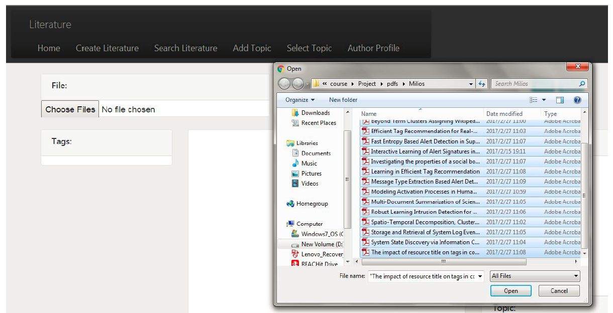
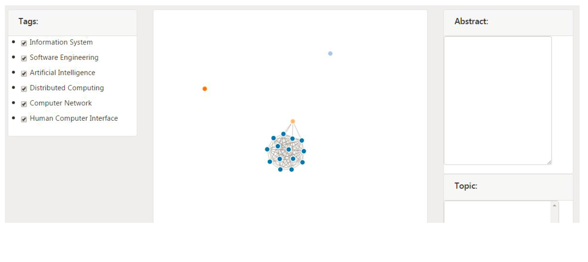

# **Djangomongo**

## **Abstract of the project:**

Expertise modeling is about profiling an expert based on contents from research articles. 
In our lab, previous research was conducted to address the problem of assigning research 
topics to articles. Hierarchical classifiers were trained to assign at least one research 
topic to a given research article of a researcher based on its title and abstract. In the 
current work, we built up a user interface which allows user to work with the hierarchical 
classifier directly. Briefly, user can select a collection of research articles of a 
researcher in pdf format. The interface automatically extracts title and contents from the 
selected pdfs and uses the trained hierarchical classifier to do the job of topic assignments. 
The interface would save all the original and processed information into database and generate 
a report about the researcher profile for the user. User can play with the interactive 
graphical report and navigate into detail for each individual article. User can also give 
feedback to the system automatically assigned topics for each individual article. 

## **Folder information**

* djangomongo
	- static/bootstrap/js: uploadimage.js, resettopics.js, linkMultiplechoicefield.js, and linkdropdownlost.js
						   (front end ajax methods to handle web page events)
	- templates: base.html and messages.html 
				 (base html)
* blog
	- static/bootstrap/js: all the files
						   (back end server logics, critical parts consist of models.py, views.py, urls.py, and so on)
	- templates/blog: add_topic.html post_create.html, post_detail.html, post_list.html, post_search.html,
					  post_update.html, researcher-profile.html, and select_topic.html
					  (extend base html)

## **Features**
* UI to load a bunch of pdf files and extract contents from pdf files
* predict research topics for uploaded pdf files using trained hierarchical model
* generate D3.js force-directed graph to visualize the topic prediction to users
* user can make change to the predicted research topics if necessary

## **Author Profile**

#### **upload a bunch of pdf files**

upload a bunch of pdf files under the name of particular researcher.

#### **D3 Force-directed Graph**

Generate the D3 Force-directed Graph. Each node corresponds to a research article. The color of node corresponds to the dominant 
research topic. Each article can be multiple labeled. Nodes are connected by link if they are corresponding to the same research 
topic.

